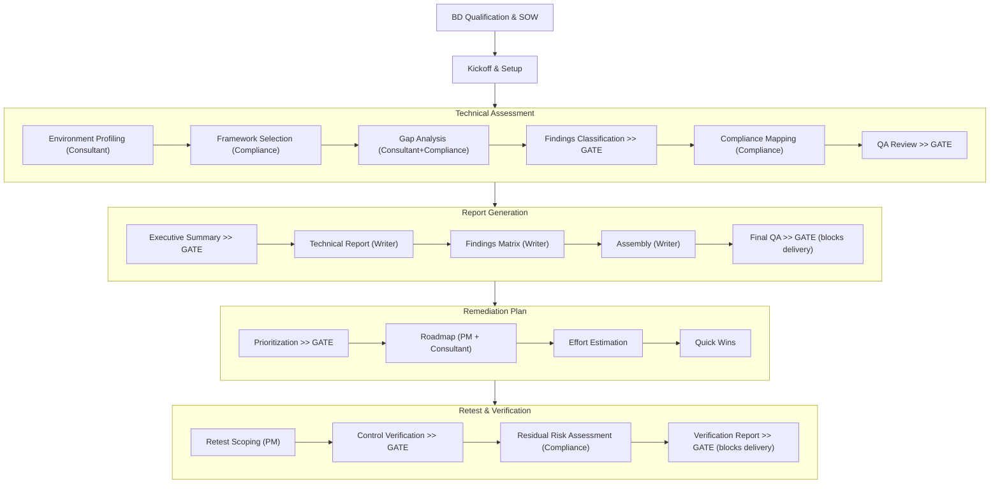

```
 ██████╗██████╗ ███████╗██╗    ██╗
██╔════╝██╔══██╗██╔════╝██║    ██║
██║     ██████╔╝█████╗  ██║ █╗ ██║
██║     ██╔══██╗██╔══╝  ██║███╗██║
╚██████╗██║  ██║███████╗╚███╔███╔╝
 ╚═════╝╚═╝  ╚═╝╚══════╝ ╚══╝╚══╝
```

### Consulting Role Engine Workflows

[](https://github.com/adamson34/crew/actions/workflows/test.yml)
[](LICENSE)
[](package.json)
[](https://docs.anthropic.com/en/docs/claude-code)
[](#)

---

CREW is an AI-powered consulting workflow framework that runs inside [Claude Code](https://docs.anthropic.com/en/docs/claude-code). It gives you a team of six AI agents — each with a distinct consulting role, personality, and methodology — that walk you through a full engagement lifecycle: from scoping and SOW generation through technical assessment, report writing, and remediation planning.

A `/crew` orchestrator tracks workflow state, manages review gates, and routes you to the right agent at each step. Nothing advances without your explicit approval.

**Verticals:** OT/ICS cybersecurity consulting (full knowledge pack) and cloud security (overview + CIS Controls/Benchmarks reference), selected at install time. The knowledge base and agent reference material swap automatically based on your choice — see [Adding a New Vertical](#adding-a-new-vertical).

## What It Does

CREW installs seven slash commands into Claude Code: six role-based agents and one orchestrator. Each agent is a detailed persona with domain expertise, decision-making principles, and a communication style modeled after a real consulting role. You interact with them naturally — ask Marcus to scope an engagement, tell Jake to run a gap analysis, have Eli draft the executive summary.

The agents share a structured workflow with human review gates at every critical handoff. The orchestrator (`/crew`) reads a state file that tracks which steps are done, which gates are pending, and what artifacts have been produced.

### The Team

| Command | Agent | Role | What They Do |
|---------|-------|------|-------------|
| `/crew` | Orchestrator | Workflow Management | Shows status, routes to next step, handles gate approvals |
| `/bd` | Marcus Webb | Business Development | Qualifies opportunities, generates SOWs and proposals, handles scope changes |
| `/pm` | Dana Reeves | Project Manager | Plans projects, builds timelines, tracks deliverables, manages client comms |
| `/consultant` | Jake Tanaka | Lead Consultant | Profiles environments, runs gap analysis, classifies findings, reviews architecture |
| `/compliance` | Priya Kapoor | Compliance Analyst | Selects frameworks, maps compliance, validates controls, builds crosswalks |
| `/writer` | Eli Carter | Technical Writer | Writes executive summaries, technical reports, findings matrices, remediation plans |
| `/reviewer` | Sofia Mendez | QA Reviewer | Reviews findings registers and final deliverables, audits severity ratings |

### What You Get Out

CREW produces the core deliverables of a consulting engagement:

- **Statement of Work** — scope, deliverables, timeline, team, investment
- **Level of Effort estimates** — work package breakdowns with hour ranges and uncertainty flags
- **Environment profiles** — architecture, asset inventory, network topology
- **Gap analysis** — structured control assessments against selected frameworks
- **Findings register** — classified findings with severity, evidence, and recommendations
- **Compliance mappings** — findings mapped to NERC CIP, IEC 62443, NIST CSF, or NIST SP 800-82
- **Executive summary** — client-ready assessment overview
- **Technical report** — detailed findings and analysis
- **Findings matrix** — sortable table of all findings with status tracking
- **Remediation roadmap** — phased plan with effort estimates, quick wins, and success criteria
- **Verification report** — confirms which remediation items were actually implemented, with residual risk on anything that wasn't

### Engagement Lifecycle



> **>> GATE** = Human review required before proceeding

Every gate is a deliberate pause where you review AI-generated work before it moves forward. Findings can be wrong, over-stated, or under-stated — the gates exist because a human expert must validate before anything becomes a client deliverable.

---

## Installation

### Prerequisites

- [Claude Code](https://docs.anthropic.com/en/docs/claude-code) installed and working
- Node.js (for the installer script)

### Install

```bash
# 1. Download CREW
git clone https://github.com/adamson34/crew.git

# 2. Create an engagement project directory and cd into it
mkdir acme-assessment && cd acme-assessment

# 3. Run the installer
node /path/to/CREW/crew/install.js
```

The installer prompts you for:

| Prompt | Default | Purpose |
|--------|---------|---------|
| Firm name | *(blank)* | Stamped into SOWs, proposals, and agent context |
| Your name | *(blank)* | Identifies the engagement lead |
| Engagement name | Directory name | Labels all outputs |
| Client name | "Client" | Used in deliverable templates |
| Consulting vertical | ot-ics | Selects which knowledge-base files and reference material get stamped into agents and workflows (ot-ics or cloud-security; other options fall back to ot-ics) |
| Consultant skill level | intermediate | Controls how much guidance agents provide |
| Artifact paths | engagement/, assessment/, deliverables/ | Where outputs are written |

After installation, your engagement directory looks like this:

```
acme-assessment/
├── CLAUDE.md                     # Engagement context for Claude Code
├── .crew                         # Engagement config (YAML)
├── .crew-state.yaml              # Workflow state tracking
├── .claude/
│   └── commands/
│       ├── crew.md               # /crew orchestrator
│       ├── bd.md                 # /bd slash command
│       ├── pm.md                 # /pm slash command
│       ├── consultant.md         # /consultant slash command
│       ├── compliance.md         # /compliance slash command
│       ├── writer.md             # /writer slash command
│       └── reviewer.md           # /reviewer slash command
├── crew/                         # Full module (workflows, templates, data, knowledge base)
├── engagement/                   # SOW, project plan, comms artifacts
├── assessment/                   # Findings, evidence, notes
└── deliverables/                 # Reports, roadmaps, presentations
```

### Reconfigure or Uninstall

```bash
# Re-run with different config
node crew/install.js

# Remove everything CREW installed (agents, .crew, .crew-state.yaml, CLAUDE.md, crew/)
node crew/install.js --uninstall
```

---

## Documentation

Start here: **[Getting Started](docs/getting-started.md)** — a step-by-step tutorial for your first engagement.

| Doc | What It Covers |
|-----|---------------|
| [Getting Started](docs/getting-started.md) | First-engagement tutorial: install through deliverables |
| [Architecture](docs/architecture.md) | End-to-end system design, bootstrapping flow, preamble protocol, data flow |
| [Installation Guide](docs/installation-guide.md) | Installer deep dive: config fields, `.crew` file, placeholder stamping, uninstall |
| [Hooks Reference](docs/hooks-reference.md) | All 5 hooks: events, matchers, exit codes, settings.json format, debugging |
| [Orchestrator Reference](docs/orchestrator-reference.md) | All 9 `/crew` commands (ST, NX, GA, GR, IN, RS, AF, RH, RC) |
| [Agent Overview](docs/agents/overview.md) | Shared agent behavior, state preamble, agent-workflow mapping |
| [Agent: BD](docs/agents/bd.md), [PM](docs/agents/pm.md), [Consultant](docs/agents/consultant.md), [Compliance](docs/agents/compliance.md), [Writer](docs/agents/writer.md), [Reviewer](docs/agents/reviewer.md) | Individual agent profiles, menu commands, principles, workflow participation |
| [Workflow Overview](docs/workflows/overview.md) | How workflows, steps, and gates fit together |
| [Workflow Definition Reference](docs/workflow-definition-reference.md) | Complete `workflow.yaml` schema: steps, gates, branching, prerequisites, artifacts |
| [Engagement Kickoff](docs/workflows/engagement-kickoff.md), [New Engagement](docs/workflows/new-engagement.md), [Assessment](docs/workflows/assessment.md), [Report Generation](docs/workflows/report-generation.md), [Remediation Plan](docs/workflows/remediation-plan.md), [Retest & Verification](docs/workflows/retest-verification.md) | Step-by-step workflow walkthroughs with gate details |
| [State Management](docs/state-management.md) | `.crew-state.yaml` schema, lifecycle diagrams, revision tracking, manual editing |
| [Extending CREW](docs/extending-crew.md) | Adding agents, workflows, templates, verticals, data files, task files |
| [Troubleshooting](docs/troubleshooting.md) | Common issues and fixes for installation, state, workflows, agents, and rework |

**Reading order for new users:** Getting Started > Architecture > Orchestrator Reference > Agent Overview > Workflow Overview > individual agent/workflow pages as needed.

**Reading order for developers/extenders:** Architecture > Installation Guide > Hooks Reference > Workflow Definition Reference > Extending CREW.

---

## How It Works

### Agents

CREW agents are markdown files installed as Claude Code [slash commands](https://docs.anthropic.com/en/docs/claude-code). When you type `/consultant` in Claude Code, it loads Jake Tanaka's full persona — his background, principles, methodology, and available workflows. You then interact with him naturally.

Each agent has a **state preamble** that makes it check `.crew-state.yaml` before doing work. If a prerequisite step isn't complete or a blocking gate hasn't been approved, the agent stops and tells you what's needed. After completing work, the agent updates the state file and registers produced artifacts.

**Agents are roles, not task runners.** Each has a name, personality, communication style, and decision-making principles that shape output quality. Marcus approaches a SOW differently than Jake approaches a finding — that difference is intentional.

### Orchestrator

The `/crew` command is the workflow management hub. It doesn't do consulting work — it manages state:

| Command | What It Does |
|---------|-------------|
| **ST** — Status | Dashboard showing step progress, gate statuses, artifact count |
| **NX** — Next Step | Identifies the next actionable step and tells you which agent to invoke |
| **GA** — Gate Approval | Lists pending gates, records your approval, unblocks downstream steps |
| **GR** — Gate Rejection | Rejects a gate with notes, keeps downstream steps blocked |
| **IN** — Initialize | Picks a workflow, parses its definition, scaffolds steps and gates into state |
| **RS** — Reset Step | Resets a step to `not_started` (useful after gate rejection or rework) |
| **AF** — Artifacts | Lists all produced artifacts with provenance |

Typical flow: run `/crew IN` to start a workflow, then `/crew NX` to see what's next. The orchestrator tells you which agent to invoke. After each step, come back to `/crew` for gate approvals and routing.

### State File

`.crew-state.yaml` tracks everything across sessions:

```yaml
crew_version: "1.0.0"
engagement: "acme-assessment"
initialized_at: "2026-02-26T10:00:00Z"

active_workflow:
  id: assessment
  started_at: "2026-02-26T10:00:00Z"
  status: in_progress

steps:
  step-01-environment-profiling:
    status: completed
    agent: consultant
    started_at: "2026-02-26T10:05:00Z"
    completed_at: "2026-02-26T12:30:00Z"
    artifacts_produced:
      - assessment/acme-environment-profile.md

  step-02-framework-selection:
    status: in_progress
    agent: compliance
    started_at: "2026-02-26T13:00:00Z"

gates:
  gate-findings-classification:
    status: pending
    after_step: step-04-findings-classification
    blocks: [step-05-compliance-mapping]

artifacts:
  - path: "assessment/acme-environment-profile.md"
    produced_by: consultant
    step: step-01-environment-profiling
    produced_at: "2026-02-26T12:30:00Z"

completed_workflows:
  - id: engagement-kickoff
    completed_at: "2026-02-26T09:30:00Z"
```

The state file is human-readable and manually editable. If something goes wrong, you can edit it directly.

`completed_workflows` tracks which workflows have been finished. When you initialize a new workflow with `/crew IN`, the orchestrator checks that any required prior workflows have been completed — for example, `assessment` requires `engagement-kickoff` or `new-engagement` to be completed first. This prevents starting downstream workflows before the artifacts they depend on exist.

### CLAUDE.md

The installer generates a `CLAUDE.md` file in your engagement root. Claude Code reads this automatically at the start of every session, giving it engagement context (client name, firm, vertical), the agent table, behavioral rules (check state, respect gates, update after work), and directory layout.

### Workflows

Workflows are YAML definitions in `crew/workflows/`. Each declares the step order, prerequisites, gates, and artifact patterns. The orchestrator reads these at runtime — they're executable configuration, not just documentation.

**Domain knowledge is modular.** The OT/ICS starter pack is the first vertical. Swap out the knowledge base and data files for a different domain and the same agent structure and workflows apply.

---

## What's Included

### Data

| File | What It Contains |
|------|-----------------|
| `data/service-catalog.yaml` | Firm service offerings with match keywords, delivery types, team composition, and typical duration. Used by BD agent to validate inbound opportunities. |
| `data/severity-scales.yaml` | Five-level severity scale (Critical through Informational) with CVSS ranges, remediation timelines, OT-specific guidance, and rating documentation requirements. |
| `data/standards-crosswalks.yaml` | Control domain mappings across NERC CIP, IEC 62443, NIST CSF, and NIST SP 800-82. Used by the compliance agent for multi-framework assessments. |
| `data/engagement-history.yaml` | Past engagement LOE data for benchmarking estimates. |

### Knowledge Base

**OT/ICS** (full pack):

| File | Coverage |
|------|----------|
| `knowledge-base/ot-ics-overview.md` | Purdue model, zone/conduit model, IT vs OT differences, common attack vectors and vulnerabilities |
| `knowledge-base/nerc-cip-reference.md` | NERC CIP standards (CIP-002 through CIP-013), scope, common findings, evidence requirements |
| `knowledge-base/iec-62443-reference.md` | IEC 62443 series structure, security levels (SL1-4), foundational and system requirements, common gaps |
| `knowledge-base/nist-csf-reference.md` | NIST CSF 2.0 functions, 23 categories, OT-specific guidance, cross-framework mappings |

**Cloud Security:**

| File | Coverage |
|------|----------|
| `knowledge-base/cloud-security-overview.md` | Shared responsibility model, cloud-native architecture concepts, common attack vectors and vulnerabilities, key incidents |
| `knowledge-base/cis-controls-reference.md` | CIS Controls v8 (18 categories), CIS Benchmarks per platform (AWS/Azure/GCP/Kubernetes/M365), Well-Architected crosswalk |

### Templates

SOW, executive summary, technical report, findings matrix, remediation roadmap, level of effort, assumptions, and task assignment templates. Each defines the structure and sections of a deliverable — agents fill in the content.

---

## Adding a New Vertical

OT/ICS is the full starter pack; cloud security is the second, currently overview + one framework reference. The installer selects between them (and falls back to OT/ICS for any vertical without an entry) via a `VERTICAL_KNOWLEDGE_BASE` map in `crew/install.js`, which drives the `{{vertical_knowledge_base_yaml}}`, `{{vertical_overview_yaml}}`, `{{vertical_overview_reference}}`, and `{{vertical_framework_references}}` placeholders stamped into `consultant.md`, `compliance.md`, and the `assessment`/`new-engagement`/`engagement-kickoff` workflow YAMLs at install time — nothing needs to be edited per-project.

To add a new consulting domain (penetration testing, GRC, IT audit):

1. **Add knowledge base files** in `knowledge-base/` for the new domain — one overview file, plus any framework-specific references
2. **Add an entry to `VERTICAL_KNOWLEDGE_BASE`** in `crew/install.js`, marking the overview entry with `overview: true`
3. **Add service-catalog entries** in `data/service-catalog.yaml` with `vertical: <your-vertical>` so the BD agent can match opportunities against it
4. **Update `data/severity-scales.yaml`** if the domain has different severity considerations (this file is currently shared across all verticals)
5. **Add domain-specific standards** to `data/standards-crosswalks.yaml`, or a separate crosswalk file, if the domain needs one (currently OT/ICS-specific; not yet vertical-selected)
6. **Add domain-specific workflow steps** where methodology differs from the existing OT/ICS-authored step files

The core agent structure, workflow phases, and review gates are domain-agnostic — only the knowledge base, reference material, and (for now) the standards crosswalk change per vertical.

---

## Relationship to BMAD

CREW was originally designed as an expansion module for the [BMAD-METHOD](https://github.com/bmad-code-org/BMAD-METHOD) framework, which provides agentic workflows for software development teams. CREW adapts that pattern for consulting teams.

**In practice, CREW runs independently.** The BMAD integration is a packaging convention (the `module.yaml` file), but the compiled agents and installer work without BMAD installed. If you're using BMAD, CREW can be installed as a module via `npx bmad-method install`. If you're not, the standalone `node install.js` path works on its own.

---

## Roadmap

### Current State

CREW is a working tool covering two verticals (OT/ICS cybersecurity — full pack, cloud security — overview + CIS reference), selected at install time. It runs locally via `node install.js` (or non-interactively via `node install.js --yes`), tracks workflow state across sessions, enforces review gates, and routes users between agents via the `/crew` orchestrator. Six role agents, six workflow phases (engagement kickoff/new-engagement through remediation planning and retest verification), templates, reference data, and the orchestrator are all functional, backed by an automated test suite (hook behavior, end-to-end installer smoke test, and workflow structural validation) running in CI on every push and PR.

### Near-Term

- **npm distribution** — publish as a package so users can install via `npx` without cloning
- **Additional templates** — client-facing presentation decks, data request checklists, closeout reports
- **Vertical-aware standards crosswalks** — `data/standards-crosswalks.yaml` is still OT/ICS-only; cloud security has no equivalent control-mapping file yet
- **Closeout/lessons-learned workflow** — nothing currently writes engagement outcomes back to `data/engagement-history.yaml`

### Medium-Term

- **Additional verticals** — IT audit, GRC, and penetration testing knowledge packs (cloud security landed; see [Adding a New Vertical](#adding-a-new-vertical))
- **Multi-engagement management** — support multiple concurrent engagements from a single CREW install
- **Evidence management** — structured evidence collection, linking, and referencing within findings
- **Custom service catalogs** — let firms define their own service offerings and agent behavior

### Long-Term

- **Team collaboration** — multiple consultants working the same engagement with shared state
- **Client portal integration** — export deliverables to client-facing platforms
- **Engagement analytics** — track patterns across engagements (common findings, time-to-deliver, scope accuracy)

---

## Links

- BMAD-METHOD: https://github.com/bmad-code-org/BMAD-METHOD
- NERC CIP Standards: https://www.nerc.com/pa/Stand/Pages/CIPStandards.aspx
- IEC 62443 (ISA): https://www.isa.org/standards-and-publications/isa-standards/isa-iec-62443-series-of-standards
- NIST CSF 2.0: https://www.nist.gov/cyberframework
- NIST SP 800-82 Rev 3: https://csrc.nist.gov/publications/detail/sp/800-82/rev-3/final
