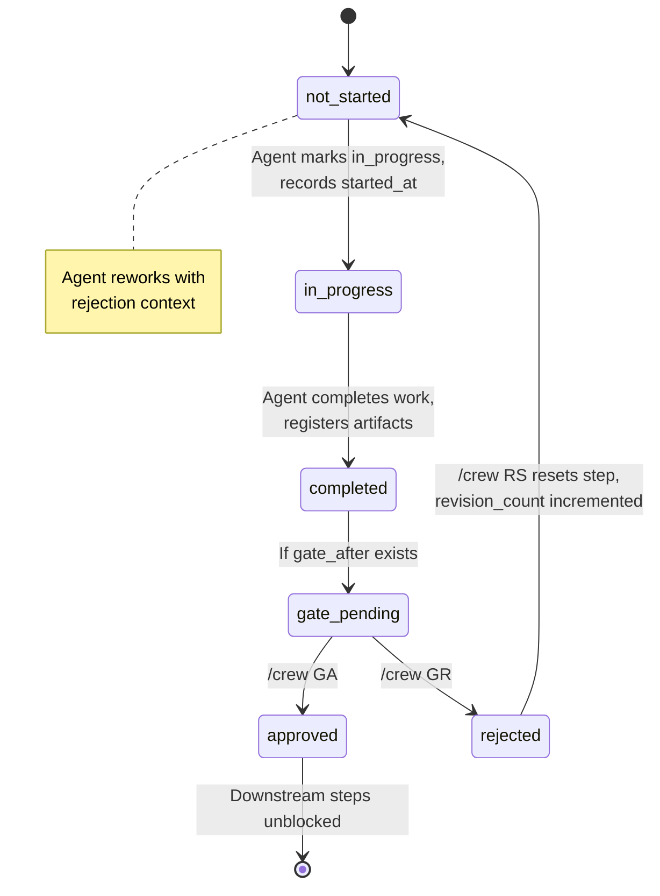
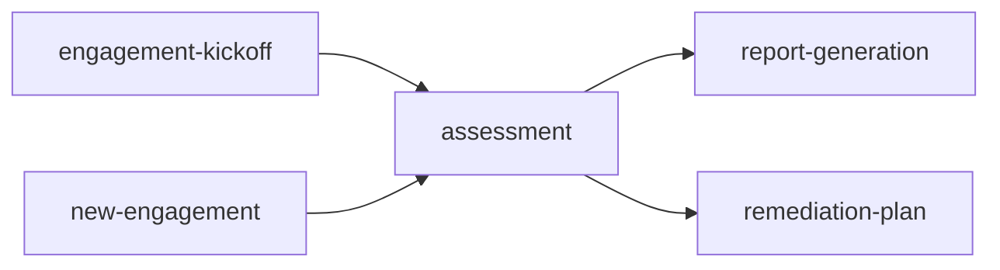

# Workflow System Overview

Workflows are YAML definitions that tell the orchestrator what steps to track, what order they run in, and where human review gates sit. They're executable configuration — not just documentation.

## Where Workflows Live

```
crew/workflows/
  engagement-kickoff/
    workflow.yaml
    steps/
  new-engagement/
    workflow.yaml
    steps/
  assessment/
    workflow.yaml
    steps/
  report-generation/
    workflow.yaml
    steps/
  remediation-plan/
    workflow.yaml
    steps/
```

Each workflow has a `workflow.yaml` definition and a `steps/` directory with detailed instructions for each step. The orchestrator reads the YAML; agents read the step files.

Workflow YAMLs are **read-only** — never modified at runtime. All mutable state lives in `.crew-state.yaml`.

## Workflow YAML Structure

### Steps Array

Each step declares:

| Field | Description |
|-------|-------------|
| `id` | Unique step identifier (e.g., `step-01-environment-profiling`) |
| `file` | Path to step instruction file |
| `agent` | Which agent owns this step (`bd`, `pm`, `consultant`, `compliance`, `writer`, `reviewer`) |
| `prerequisites` | Steps that must be `completed` before this step can start |
| `prerequisites_any` | At least ONE of these steps must be completed (used for convergence points) |
| `gate_after` | Gate ID that activates after this step completes |
| `required_artifacts` | Files that must exist on disk before the step starts |
| `produces` | Artifact patterns this step creates |
| `path` | (Optional) Only applies when this path (A or B) is active |
| `optional` | (Optional) Step can be skipped |

### Gates Array

Each gate declares:

| Field | Description |
|-------|-------------|
| `id` | Unique gate identifier (e.g., `gate-findings-classification`) |
| `after_step` | Which step triggers this gate |
| `blocks` | Steps that cannot start until this gate is `approved` |
| `description` | What the reviewer should check |
| `required_approvers` | (Optional) Specific roles that must approve |
| `blocking` | (Optional) If `true`, this is a hard stop — delivery is blocked |
| `condition` | (Optional) Gate only triggers under certain conditions |

## Step Lifecycle



**Constraint:** Only one step can be `in_progress` at a time.

## Prerequisite Logic

### Within a Workflow

- **`prerequisites`** — ALL listed steps must be `completed`
- **`prerequisites_any`** — AT LEAST ONE listed step must be `completed` (convergence points where branching paths merge)
- **Gate blocking** — Steps listed in a gate's `blocks` array are held until the gate is `approved`

Both prerequisite types and gate blocking are checked by the orchestrator (`/crew NX`) and enforced by agents via the state preamble.

### Across Workflows

Workflows can declare dependencies on other completed workflows via the `requires_workflows` field in their `workflow.yaml`:

```yaml
requires_workflows:
  - any_of: [engagement-kickoff, new-engagement]
    reason: "SOW must exist before assessment begins"
```

`any_of` means at least one of the listed workflows must be in `completed_workflows` in the state file. The orchestrator checks this during `/crew IN` and warns if prerequisites aren't met — the user can override if they have artifacts from outside CREW.

When `/crew NX` detects all non-optional steps are completed and all gates approved, it auto-completes the workflow and appends it to `completed_workflows`, unblocking downstream workflows.

**Dependency graph:**



## Available Workflows

| Workflow | Steps | Gates | Primary Agents | Requires | Use When |
|----------|-------|-------|----------------|----------|----------|
| [engagement-kickoff](engagement-kickoff.md) | 6 | 3 | BD, PM | — | Starting a new engagement (scoping through kickoff) |
| [new-engagement](new-engagement.md) | 10+ | 6 | All | — | Full end-to-end lifecycle in one workflow |
| [assessment](assessment.md) | 6 | 2 | Consultant, Compliance, Reviewer | engagement-kickoff OR new-engagement | Core technical assessment phase |
| [report-generation](report-generation.md) | 5 | 2 | Writer, Reviewer | assessment OR new-engagement | Assembling client deliverables |
| [remediation-plan](remediation-plan.md) | 4 | 1 | Consultant, PM | assessment OR new-engagement | Building the remediation roadmap |

## Recommended Sequencing

If running workflows individually (not using new-engagement):

1. **engagement-kickoff** — Scoping, SOW, project setup
2. **assessment** — Environment profiling, gap analysis, findings, QA
3. **report-generation** — Executive summary, technical report, findings matrix, final QA
4. **remediation-plan** — Prioritization, roadmap, effort estimation, quick wins

This sequence is enforced by `requires_workflows` declarations — the orchestrator will warn if you try to initialize a workflow before its prerequisites are completed. For example, starting `assessment` before `engagement-kickoff` is completed will prompt a warning explaining that a SOW must exist first. You can override if you have the necessary artifacts from outside CREW.

---

## See Also

- [Workflow Definition Reference](../workflow-definition-reference.md) — Complete `workflow.yaml` schema
- [Orchestrator Reference](../orchestrator-reference.md) — `/crew IN` to initialize, `/crew NX` to navigate
- [Agent Overview](../agents/overview.md) — Which agents own which steps
- [State Management](../state-management.md) — How steps and gates are tracked in `.crew-state.yaml`
- [Extending CREW](../extending-crew.md) — How to add new workflows
